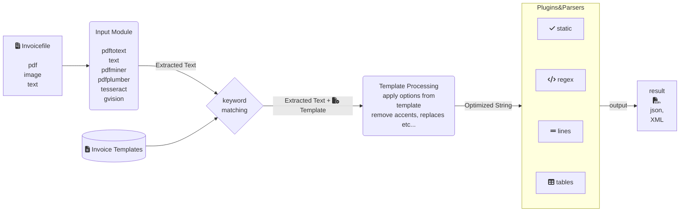

# Data extractor for PDF invoices - invoice2data

[](https://github.com/invoice-x/invoice2data/actions)
[](https://pypi.python.org/pypi/invoice2data)
[](https://pypi.python.org/pypi/invoice2data)

A command line tool and Python library to support your accounting
process.

1. extracts text from PDF files using different techniques, like
   `pdftotext`, `text`, `ocrmypdf`, `pdfminer`, `pdfplumber` or OCR -- `tesseract`, or
   `gvision` (Google Cloud Vision).
2. searches for regex in the result using a YAML or JSON-based template system
3. saves results as CSV, JSON or XML or renames PDF files to match the content.

With the flexible template system you can:

- precisely match content PDF files
- plugins available to match line items and tables
- define static fields that are the same for every invoice
- define custom fields needed in your organisation or process
- have multiple regex per field (if layout or wording changes)
- define currency
- extract invoice-items using the `lines`-plugin developed by [Holger
  Brunn](https://github.com/hbrunn)

Go from PDF files to this:

    {'date': (2014, 5, 7), 'invoice_number': '30064443', 'amount': 34.73, 'desc': 'Invoice 30064443 from QualityHosting', 'lines': [{'price': 42.0, 'desc': u'Small Business StandardExchange 2010\nGrundgeb\xfchr pro Einheit\nDienst: OUDJQ_office\n01.05.14-31.05.14\n', 'pos': u'7', 'qty': 1.0}]}
    {'date': (2014, 6, 4), 'invoice_number': 'EUVINS1-OF5-DE-120725895', 'amount': 35.24, 'desc': 'Invoice EUVINS1-OF5-DE-120725895 from Amazon EU'}
    {'date': (2014, 8, 3), 'invoice_number': '42183017', 'amount': 4.11, 'desc': 'Invoice 42183017 from Amazon Web Services'}
    {'date': (2015, 1, 28), 'invoice_number': '12429647', 'amount': 101.0, 'desc': 'Invoice 12429647 from Envato'}



## Installation

1.  Install pdftotext

If possible get the latest
[xpdf/poppler-utils](https://poppler.freedesktop.org/) version. It's
included with macOS Homebrew, Debian and Ubuntu. Without it, `pdftotext`
won't parse tables in PDF correctly.

2.  Install `invoice2data` using pip

    pip install invoice2data

### Installation of input modules

An [tesseract](https://github.com/tesseract-ocr/tessdoc/blob/main/FAQ.md#how-do-i-get-tesseract) wrapper is included in auto language mode. It will test your input files against the languages installed on your system. To use it tesseract and imagemagick needs to be installed.
tesseract supports multiple OCR engine modes. By default the available engine installed on the system will be used.

Languages:
tesseract-ocr recognize more than [100 languages](https://github.com/tesseract-ocr/tessdata)
For Linux users, you can often find packages that provide language packs:

```
# Display a list of all Tesseract language packs
apt-cache search tesseract-ocr

# Debian/Ubuntu users
apt-get install tesseract-ocr-chi-sim  # Example: Install Chinese Simplified language pack

# Arch Linux users
pacman -S tesseract-data-eng tesseract-data-deu # Example: Install the English and German language packs

```

## Usage

Basic usage. Process PDF files and write result to CSV.

- `invoice2data invoice.pdf`
- `invoice2data invoice.txt`
- `invoice2data *.pdf`

Choose any of the following input readers:

- pdftotext `invoice2data --input-reader pdftotext invoice.pdf`
- pdftotext `invoice2data --input-reader text invoice.txt`
- tesseract `invoice2data --input-reader tesseract invoice.pdf`
- pdfminer.six `invoice2data --input-reader pdfminer invoice.pdf`
- pdfplumber `invoice2data --input-reader pdfplumber invoice.pdf`
- ocrmypdf `invoice2data --input-reader ocrmypdf invoice.pdf`
- gvision `invoice2data --input-reader gvision invoice.pdf` (needs `GOOGLE_APPLICATION_CREDENTIALS` env var)

Choose any of the following output formats:

- csv `invoice2data --output-format csv invoice.pdf`
- json `invoice2data --output-format json invoice.pdf`
- xml `invoice2data --output-format xml invoice.pdf`

Save output file with custom name or a specific folder

`invoice2data --output-format csv --output-name myinvoices/invoices.csv invoice.pdf`

**Note:** You must specify the `output-format` in order to create
`output-name`

Specify folder with yml templates. (e.g. your suppliers)

`invoice2data --template-folder ACME-templates invoice.pdf`

Only use your own templates and exclude built-ins

`invoice2data --exclude-built-in-templates --template-folder ACME-templates invoice.pdf`

Processes a folder of invoices and copies renamed invoices to new
folder.

`invoice2data --copy new_folder folder_with_invoices/*.pdf`

Processes a single file and dumps whole file for debugging (useful when
adding new templates in templates.py)

`invoice2data --debug my_invoice.pdf`

Recognize test invoices: `invoice2data invoice2data/test/pdfs/* --debug`

### Use as Python Library

You can easily add `invoice2data` to your own Python scripts as library.

    from invoice2data import extract_data
    result = extract_data('path/to/my/file.pdf')

Using in-house templates

    from invoice2data import extract_data
    from invoice2data.extract.loader import read_templates

    templates = read_templates('/path/to/your/templates/')
    result = extract_data(filename, templates=templates)


## Template system

See `invoice2data/extract/templates` for existing templates. Just extend
the list to add your own. If deployed by a bigger organisation, there
should be an interface to edit templates for new suppliers. 80-20 rule.
For a short tutorial on how to add new templates, see [TUTORIAL.md](TUTORIAL.md).

Templates are based on Yaml or JSON. They define one or more keywords to find
the right template, one or more exclude_keywords to further narrow it down
and regexp for fields to be extracted. They could also be a static value,
like the full company name.

Template files are tried in alphabetical order.

We may extend them to feature options to be used during invoice
processing.

Example:

    issuer: Amazon Web Services, Inc.
    keywords:
    - Amazon Web Services
    exclude_keywords:
    - San Jose
    fields:
      amount: TOTAL AMOUNT DUE ON.*\$(\d+\.\d+)
      amount_untaxed: TOTAL AMOUNT DUE ON.*\$(\d+\.\d+)
      date: Invoice Date:\s+([a-zA-Z]+ \d+ , \d+)
      invoice_number: Invoice Number:\s+(\d+)
      partner_name: (Amazon Web Services, Inc\.)
    options:
      remove_whitespace: false
      currency: HKD
      date_formats:
        - '%d/%m/%Y'
    lines:
        start: Detail
        end: \* May include estimated US sales tax
        first_line: ^    (?P<description>\w+.*)\$(?P<price_unit>\d+\.\d+)
        line: (.*)\$(\d+\.\d+)
        skip_line: Note
        last_line: VAT \*\*

The lines package has multiple settings:
- start > The pattern where the lines begin. This is typically the header row of the table. This row is not included in the line matching.
- end > The pattern denoting where the lines end. Typically some text at the very end or immediately below the table. Also not included in the line matching.
- first_line > Optional. This is the primary line item for each entry.
- line > If first_line is not provided, this will be used as the primary line pattern. If first_line is provided, this is the pattern for any sub-lines such as line item details.
- skip_line > Optional. If first_line is passed, this pattern indicates which sub-lines will be skipped and their data not recorded. This is useful if tables span multiple pages and you need to skip over page numbers or headers that appear mid-table.
- last_line > Optional. If first_line is passed, this pattern denotes the final line of the sub-lines and is included in the output data.

:warning: Invoice2data uses a yaml templating system. The yaml templates are loaded with [pyyaml](https://github.com/yaml/pyyaml) which is a pure python implementation. (thus rather slow)
As an alternative json templates can be used. Which are natively better supported by python.

The performance with yaml templates can be greatly increased **10x** by using [libyaml](https://github.com/yaml/libyaml)
It can be installed on most distributions by:
`sudo apt-get libyaml-dev`


## Development

If you are interested in improving this project, have a look at our
[developer guide](DEVELOP.md) to get you started quickly.

## Roadmap and open tasks

- integrate with online OCR?
- try to 'guess' parameters for new invoice formats.
- can apply machine learning to guess new parameters?
- advanced table parsing with [camelot](https://github.com/camelot-dev/camelot)

## Maintainers

- [Manuel Riel](https://github.com/m3nu)
- [Alexis de Lattre](https://github.com/alexis-via)
- [bosd](https://github.com/bosd)

## Contributors

-   [Harshit Joshi](https://github.com/duskybomb): As Google Summer of
    Code student.
-   [Holger Brunn](https://github.com/hbrunn): Add support for parsing
    invoice items.

## Used By
- Odoo, OCA module [account_invoice_import_invoice2data](https://github.com/OCA/edi)

## Related Projects

- [OCR-Invoice](https://github.com/robela/OCR-Invoice) (FOSS \| C\#)
- [DeepLogic AI](https://deeplogicai.tech/case_list/automatic-key-information-extraction-business-documents/) (Commercial \| SaaS)
- [Docparser](https://docparser.com/) (Commercial \| Web Service)
- [A-PDF](http://www.a-pdf.com/data-extractor/index.htm) (Commercial)
- [PDFdeconstruct](http://www.glyphandcog.com/PDFdeconstruct.html?g6)
  (Commercial)
- [CVision](http://www.cvisiontech.com/library/document-automation/forms-processing/extract-data-from-invoice.html)
  (Commercial)
