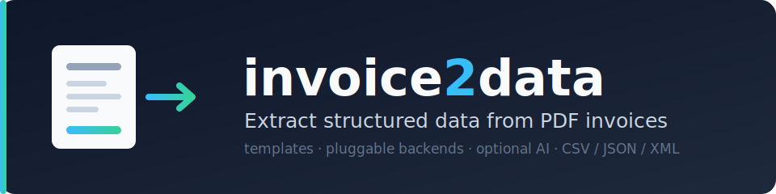

<p align="center">
  
</p>

# Data extractor for PDF invoices - invoice2data

[][read the docs]
[](https://pypi.python.org/pypi/invoice2data)
[](https://pypi.python.org/pypi/invoice2data)
[][license]
[][tests]
[][coverage]
[][pre-commit]
[](https://github.com/astral-sh/ruff)

<!-- docs-body -->

[pypi status]: https://pypi.org/project/invoice2data/
[read the docs]: https://invoice2data.readthedocs.io/
[tests]: https://github.com/invoice-x/invoice2data/actions?workflow=Tests
[coverage]: https://github.com/invoice-x/invoice2data/actions?workflow=Tests
[pre-commit]: https://github.com/pre-commit/pre-commit
[ruff badge]: https://img.shields.io/endpoint?url=https://raw.githubusercontent.com/astral-sh/ruff/main/assets/badge/v2.json
[ruff project]: https://github.com/charliermarsh/ruff

A command line tool and Python library that automates the extraction of key information from invoices to support your accounting
process. The library is very flexible and can be used on other types of business documents as well.

In essence, invoice2data simplifies getting data from invoices by:

- **Automating text extraction** — no more manual copying and pasting.
- **Using templates for structure** — handles different invoice layouts.
- **Providing structured output** — data ready for analysis or further processing.

This makes it a valuable tool for businesses and developers dealing with a large
volume of invoices, saving time and reducing manual-entry errors. It:

1. extracts text from PDF files with a pluggable, cascading backend —
   `pdfium` (default, no system deps), `pdftotext`, `text`, `pdfminer`,
   `pdfplumber`, or OCR (`tesseract`, `ocrmypdf`, `docTR`, `paddleocr`,
   `gvision`).
2. searches for regex in the result using a YAML or JSON-based template system
   (with an optional [AI fallback](https://invoice2data.readthedocs.io/en/latest/ai.html)).
3. saves results as CSV, JSON or XML, or renames PDF files to match the content.

With the flexible template system you can:

- precisely match content PDF files
- plugins available to match line items and tables
- define static fields that are the same for every invoice
- define custom fields needed in your organisation or process
- have multiple regex per field (if layout or wording changes)
- define currency
- extract invoice-items using the `lines`-plugin developed by [Holger
  Brunn](https://github.com/hbrunn)

Go from PDF files to this:

    {'issuer': 'QualityHosting', 'amount': 34.73, 'date': datetime.datetime(2014, 5, 7, 0, 0), 'invoice_number': '30064443', 'currency': 'EUR', 'desc': 'Invoice 30064443 from QualityHosting', 'template_name': 'com.qualityhosting.yml'}
    {'issuer': 'Amazon EU', 'amount': 35.24, 'date': datetime.datetime(2014, 6, 4, 0, 0), 'invoice_number': 'EUVINS1-OF5-DE-120725895', 'currency': 'EUR', 'desc': 'Invoice EUVINS1-OF5-DE-120725895 from Amazon EU'}
    {'issuer': 'Amazon Web Services', 'amount': 4.11, 'date': datetime.datetime(2014, 8, 3, 0, 0), 'invoice_number': '42183017', 'currency': 'USD', 'desc': 'Invoice 42183017 from Amazon Web Services'}
    {'issuer': 'Envato', 'amount': 101.0, 'date': datetime.datetime(2015, 1, 28, 0, 0), 'invoice_number': '12429647', 'currency': 'USD', 'desc': 'Invoice 12429647 from Envato'}


## Quickstart

```bash
pip install invoice2data
invoice2data invoice.pdf                          # extract -> CSV
invoice2data --output-format json invoice.pdf     # or JSON / XML
```

As a Python library:

```python
from invoice2data import extract_data

result = extract_data("invoice.pdf")
```

No system libraries are required by default — the `pdfium` backend bundles its own
engine. Optional backends and extras (poppler, OCR, AI, ...) are covered in the
[installation guide][installation].

## Documentation

Full documentation: **<https://invoice2data.readthedocs.io/>**

- [How it works][how-it-works] — the extraction pipeline
- [Installation][installation] — backends, OCR and optional extras
- [Usage][usage] — all CLI options and common tasks
- [Template creation][tutorial] — write templates for your invoices
- [Recommended fields][fields] — the canonical output schema
- [AI features][ai] — optional LLM fallback & template generation
- [FAQ][faq] — including a comparison with other tools

## Development

If you are interested in improving this project, have a look at our
[contributor guide] to get you started quickly.

## Roadmap and open tasks

- integrate with online OCR?
- try to 'guess' parameters for new invoice formats.
- apply machine learning to guess new parameters / template creation
- Data cleanup per field
- advanced table parsing with [pypdf_table_extraction](https://github.com/py-pdf/pypdf_table_extraction)

## Maintainers

- [Manuel Riel](https://github.com/m3nu)
- [Alexis de Lattre](https://github.com/alexis-via)
- [bosd](https://github.com/bosd)

## Contributors and Credits

- [Harshit Joshi](https://github.com/duskybomb): As Google Summer of
  Code student.
- [Holger Brunn](https://github.com/hbrunn): Add support for parsing
  invoice items.

[pypi]: https://pypi.org/
[file an issue]: https://github.com/invoice-x/invoice2data/issues
[pip]: https://pip.pypa.io/

Contributions are very welcome.
To learn more, see the [Contributor Guide].

## Used By

- Odoo, OCA module [account_invoice_import_invoice2data](https://github.com/OCA/edi)

## Related Projects

- [OCR-Invoice](https://github.com/robela/OCR-Invoice) (FOSS \| C\#)
- [DeepLogic AI](https://deeplogicai.tech/case_list/automatic-key-information-extraction-business-documents/) (Commercial \| SaaS)
- [Docparser](https://docparser.com/) (Commercial \| Web Service)
- [A-PDF](http://www.a-pdf.com/data-extractor/index.htm) (Commercial)
- [PDFdeconstruct](http://www.glyphandcog.com/PDFdeconstruct.html?g6)
  (Commercial)
- [CVision](http://www.cvisiontech.com/library/document-automation/forms-processing/extract-data-from-invoice.html)
  (Commercial)

<!-- github-only -->

[license]: https://invoice2data.readthedocs.io/latest/license.html
[contributor guide]: https://invoice2data.readthedocs.io/latest/contributing.html
[command-line reference]: https://invoice2data.readthedocs.io/latest/usage.html
[tutorial]: https://invoice2data.readthedocs.io/latest/tutorial.html
[installation]: https://invoice2data.readthedocs.io/latest/installation.html
[how-it-works]: https://invoice2data.readthedocs.io/latest/how-it-works.html
[usage]: https://invoice2data.readthedocs.io/latest/usage.html
[fields]: https://invoice2data.readthedocs.io/latest/recommended-template-fields.html
[ai]: https://invoice2data.readthedocs.io/latest/ai.html
[faq]: https://invoice2data.readthedocs.io/latest/faq.html
