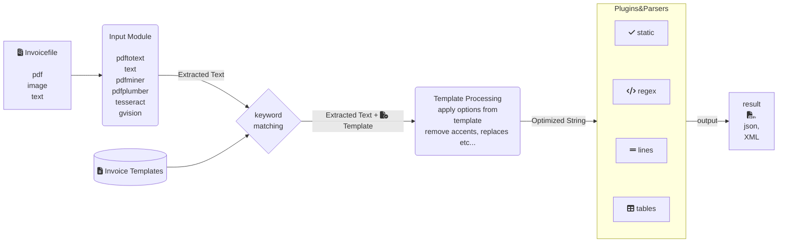

How It Works
============

This part of the documentation includes a high-level explanation of how invoice2data extracts text from PDF files.

## 1. Text Extraction:

Variety of Techniques: invoice2data uses different methods to extract text from PDF invoices. It can utilize tools like pdftotext, pdfminer, or even OCR (Optical Character Recognition) if the PDF is image-based.

## 2. Template Matching:

YAML or JSON Templates: You provide invoice2data with a template that defines the structure of your invoices. This template uses regular expressions (regex) to identify and locate specific pieces of information like invoice number, date, total amount, etc.
Flexible Templates: The template system is designed to be flexible and can handle variations in invoice layouts. You can define static fields, line item patterns, and even use plugins for complex table extraction.

## 3. Data Extraction:

Regex Matching: invoice2data uses the regex patterns in your template to search the extracted text and identify the relevant information.
Data Organization: The extracted data is then organized into a structured format, such as a dictionary or a list, making it easy to work with.

## 4. Output:

Various Formats: You can output the extracted data in different formats like CSV, JSON, or XML.
File Renaming: invoice2data can even rename the PDF files based on the extracted information.
