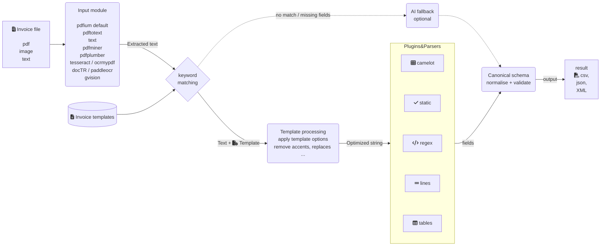

# How It Works

This part of the documentation gives a high-level overview of how invoice2data
turns a PDF (or image) into structured data.

```mermaid

flowchart LR

    InvoiceFile[fa:fa-file-invoice Invoice file\n\npdf\nimage\ntext] --> Input-module(Input module\n\npdfium default\npdftotext\ntext\npdfminer\npdfplumber\ntesseract / ocrmypdf\ndocTR / paddleocr\ngvision)

    Input-module --> |Extracted text| C{keyword\nmatching}

    Invoice-Templates[(fa:fa-file-lines Invoice templates)] --> C{keyword\nmatching}

    C --> |Text + fa:fa-file-circle-check Template| E(Template processing\napply template options\nremove accents, replaces ...)

    E --> |Optimized string| Plugins&Parsers(Plugins + parsers)

    subgraph Plugins&Parsers
      direction BT
        tables[fa:fa-table tables] ~~~ lines[fa:fa-grip-lines lines]
        lines ~~~ regex[fa:fa-code regex]
        regex ~~~ static[fa:fa-check static]
        static ~~~ camelot[fa:fa-table-cells camelot]
    end

    Plugins&Parsers --> |fields| V(Canonical schema\nnormalise + validate)
    C -.->|no match / missing fields| AI(AI fallback\noptional)
    AI -.-> V
    V --> |output| result[result\nfa:fa-file-csv csv,\njson,\nXML]

 click Invoice-Templates "tutorial.html"
 click result "usage.html"
 click Input-module "installation.html"
 click AI "ai.html"
 click E "tutorial.html"
 click tables "tutorial.html"
 click lines "tutorial.html"
 click regex "tutorial.html"
 click static "tutorial.html"
 click camelot "tutorial.html"

```

## 1. Text extraction

invoice2data extracts text with a pluggable backend. By default it tries an
ordered **cascade** — `pdfium` first (a self-contained wheel, no system binaries),
then `pdftotext` — and falls back to OCR (`ocrmypdf`) as a last resort. You can
force a backend with `--input-reader`, and a template can pin the backend it was
authored for with a top-level `input_module:`. See {doc}`installation` for the
optional backends (docTR, PaddleOCR, Google Vision, ...).

## 2. Template matching

YAML or JSON templates describe each invoice layout. A template is selected by
matching its `keywords` against the extracted text; regular expressions then
locate the fields. The system is flexible: static fields, multiple regexes per
field, line-item and table plugins, and per-field options.

## 3. Data extraction

The matched template's regexes (and the `lines`/`tables`/`camelot` plugins) pull
the values out of the optimized text. Results are then **normalised to the
canonical field schema** and lightly **validated** (typo-aware field names, tax
totals); see {doc}`recommended-template-fields`.

## 4. Optional AI fallback

When no template matches — or a match misses required fields — an optional,
configured LLM can extract the canonical fields instead. This is opt-in and
text-only; see {doc}`ai`.

## 5. Output

The structured data is written as CSV, JSON or XML, or used to rename the source
PDF based on its contents.
